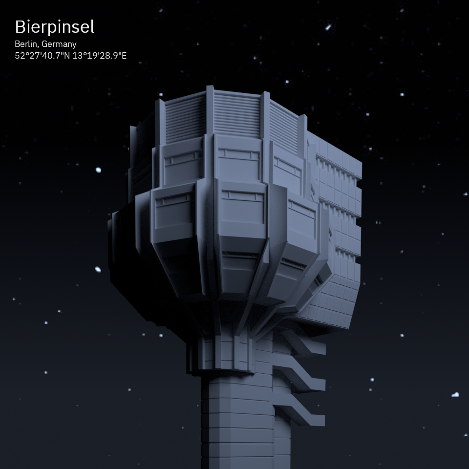

========
Stýpelas
========

Stýpelas is a project to model various bits of architecture that I like, in order
to learn, practice and improve my abilities to model in `Blender`_. Most of the
models are from Berlin or London.

Berlin
=======

.. _Blender: https://www.blender.org/
